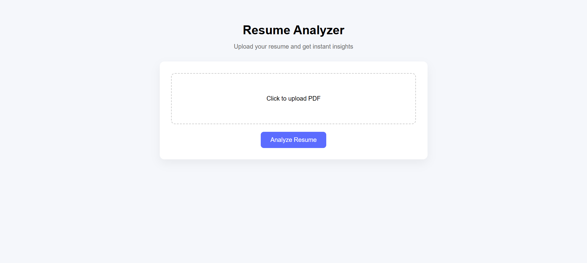

## 🚀 Live Demo
👉 https://resume-analyzer-murex-mu.vercel.app

# Resume Analyzer 🚀

A simple AI-powered Resume Analyzer that gives insights on skills, score, and suggestions.

## 🔗 Live Demo
Frontend: https://resume-analyzer-murex-mu.vercel.app  
Backend API: https://resume-analyzer-asbi.onrender.com

## ⚙️ Features
- Upload resume (PDF)
- Get score out of 100
- See matched & missing skills
- Get improvement suggestions

## 🛠 Tech Stack
- Frontend: HTML, CSS, JavaScript
- Backend: FastAPI (Python)
- Deployment: Render (Backend), Vercel (Frontend)

## 📸 Screenshots



## 🚀 How to run locally
```bash
git clone <your-repo-link>
cd resume-analyzer
pip install -r requirements.txt
uvicorn app.main:app --reload


