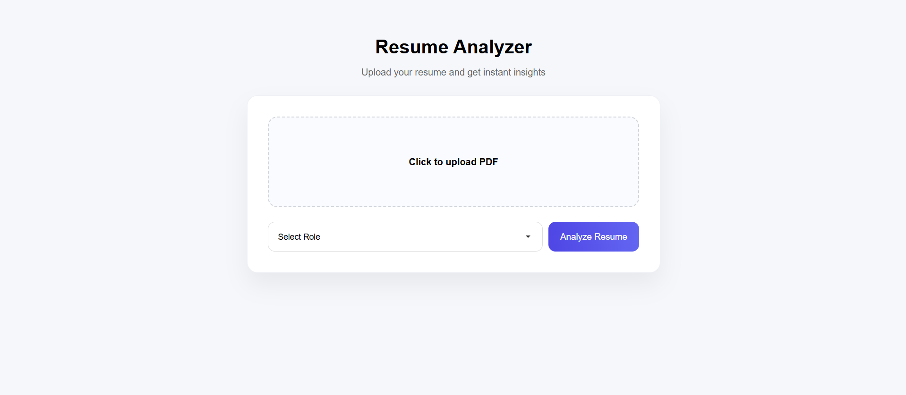
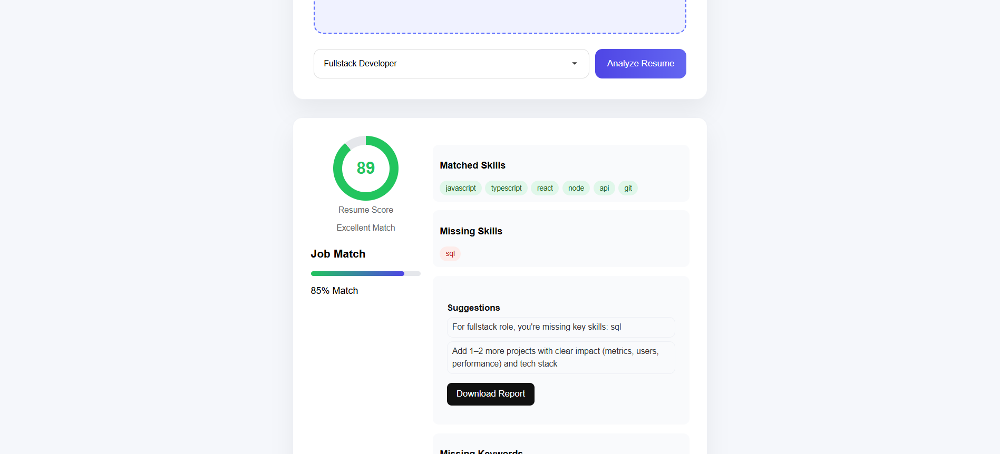

# Resume Analyzer 🚀

Analyze your resume against a job role and get clear insights on missing skills, match score, and improvements.

## 🔗 Live Demo
🌐 Live App: https://resume-analyzer-murex-mu.vercel.app  
⚙️ API: https://resume-analyzer-asbi.onrender.com

## 📷 Screenshots

### Upload Screen


### Result Screen


## 🎥 Demo Video
[▶️ Watch Demo](screenshots/resume-analyzer video.mp4)

## ⚙️ Features
- Upload resume (PDF)
- Resume score (out of 100)
- See matched & missing skills
- Get improvement suggestions
- Download report

## 🛠 Tech Stack
- Frontend: HTML, CSS, JavaScript
- Backend: FastAPI (Python)
- Deployment: Render (Backend), Vercel (Frontend)

## 🚀 How to run locally
```bash
git clone https://github.com/VinayDeveloper/resume-analyzer.git
cd resume-analyzer
pip install -r requirements.txt
uvicorn app.main:app --reload

## 🙌 Feedback
If you found this useful, consider giving it a ⭐ and sharing feedback!
